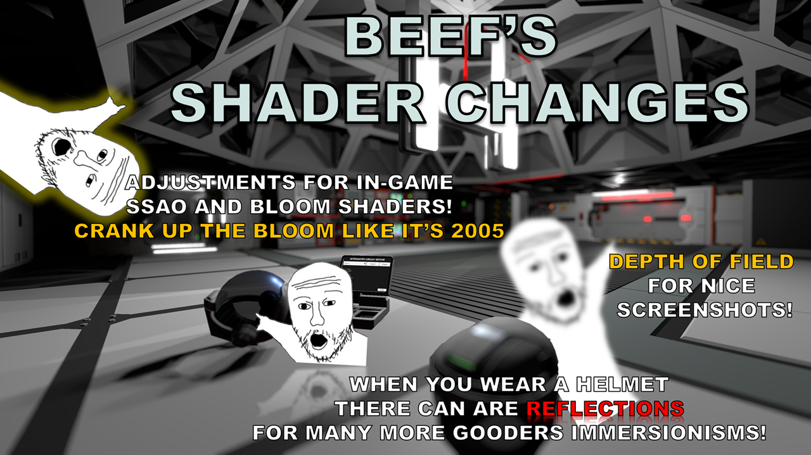

# Beef's Shader Changes

There is an in-game config menu with F10.

Post-processing and visual effects mod adding adjustments for in-game SSAO and Bloom and adding new effects.

## Features

### SSAO (Ambient Occlusion)
- Enables SSAO that's currently disabled in Stationeers
- 3 quality presets (Low/Medium/High) plus fully customizable settings
- Custom noise pattern

### Bloom
- Adjustable intensity and threshold controls

### Helmet Visor Reflections
- When enabled, automatically activates when wearing closed helmets and deactivates when open or removing helmet
- Adjustable reflection quality and intensity

### Depth of Field
- Not really great for gameplay for most, but great for screenshots
- Adjustable focal distance, focal size, and aperture

## Requirements
**WARNING:** This is a BepInEx Plugin Mod. It requires BepInEx to be installed.

See: [https://github.com/StationeersLaunchPad/StationeersLaunchPad](https://github.com/StationeersLaunchPad/StationeersLaunchPad)

## Installation

1. Ensure you have BepInEx and StationeersLaunchPad installed.
2. Install from the Steam Workshop, or manually place the folder with DLL file into your `/BepInEx/plugins/` folder.

## Usage

Press **F10** while in-game to open the configuration menu. You can also configure settings through BepInEx config files located at:
`/BepInEx/config/BeefsShaderChanges.cfg`

### Controls
- **F10** - Toggle configuration menu
- The menu only appears when in-game (not in menus or splash screens)

## Changelog

>### Version 2.0.0
> - Complete rewrite of the original shader fixes mod
> - Updated SSAO/bloom fixes from the original
> - Added helmet visor effects 
> - Added depth of field effect
> - Added in-game configuration menu (F10)

## Known Issues

## Roadmap

## Source Code

The source code is available on GitHub: TBD